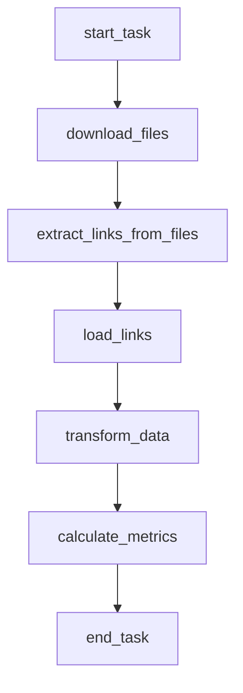

# Coding challenge - Data Engineer

Every step can be performed with whichever tool you like, unless specified.
1. Go on commoncrawl.org and download 3 segments of the most recent data (command
line)
2. Extract every external link you can find in a data structure of your choice
3. Load the data into a single column postgres table (postgres instance must be on docker)
4. Create a flag that indicates if the link redirects to a home page or a subsection of the
website
5. Aggregate by primary links and compute their frequency by also keeping track of
subsections
6. Create a column that specifies the country of the website
7. Create a column that categorizes the type of content hosted by the website by using an
external api, there are many services doing this.
8. Websites that could not be categorized by the previous step should have a flag that
indicates if the website is an ad-based domain. You can find many resources online for
this.
9. Compute at least 5 useful metrics you can think of based on both categorized and
uncategorized websites (subject to evaluation)
10. The final result must be saved in columnar (arrow is recommended) files following a
partition schema of your choosing (subject to evaluation)
11. Using an orchestration tool (airflow is recommended) build a parametric pipeline that can
be triggered on new segments of data. (the orchestration tool should also be docker
based). Parallelization wherever possible will be highly appreciated.

	
# Solution Overview

To solve the challenge, the following tools were utilized:
	•	Bash: Used for automating the download of data from external sources.
	•	Python: Used for extracting and transforming data and enrichment processes.
	•	Airflow: Orchestrates the entire workflow, managing task dependencies and scheduling.
	•	Docker: Provides containerization to ensure a consistent and reproducible environment for all components.

## Flow Diagram



1.	Start Task (start_task):
The process begins with an initial task, which could involve setting up prerequisites or initializing the workflow.
2.  Download Files (download_files):
The system retrieves the necessary files from `commoncrawl.org`.
3. 	Extract Links from Files (extract_links_from_files):
The downloaded files are analyzed to extract relevant links that will be used in the subsequent steps.
4.  Load Links (load_links):
The extracted links are stored in a PostgreSQL database for further processing or future use.
5.  Transform Data (transform_data):
The links stored in PostgreSQL are transformed, such as being cleaned, formatted, or enriched, to prepare them for final usage.
6.  Calculate Metrics (calculate_metrics):
Relevant metrics (such as link statistics, processing times, or other performance indicators) are calculated based on the transformed data and saved in arrow format.
7.  End Task (end_task):
The workflow concludes, potentially with outputs like transformed data ready for consumption, reporting, or storage.


After the transformation data are saved in parquet format to enable analysis on them (`PROJECT_ROOT_DIR/data/transformed/` directory). 
Data are partitioned by crawl data version, country and category.


## Metrics

The following metrics are calculated for each unique combination of **country** and **category**:

1. **Total Domains**  
   The total number of domains within each **country-category** pair.

2. **Subsections Count**  
   The total number of subsections within each **country-category** pair. This is the sum of the values in the `subsections` column, aggregated by country and category.

3. **Home Page Count**  
   The total number of domains marked as home pages within each **country-category** pair. It counts the number of `True` values in the `is_home_page` column.

4. **Ad-Based Count**  
   The total number of ad-based domains within each **country-category** pair. It counts the number of `True` values in the `is_ad_based` column.

5. **Country Domain Percentage**  
   The percentage of domains within each **country-category** pair relative to the total number of domains in the country. It is calculated by dividing the `total_domains` for each pair by the `total_country_domains` and multiplying by 100.

6. **Category Domain Percentage**  
   The percentage of domains within each **country-category** pair relative to the total number of domains in the category. It is calculated by dividing the `total_domains` for each pair by the `total_category_domains` and multiplying by 100.

7. **Ad-Based Percentage**  
   The percentage of ad-based domains within each **country-category** pair. It is calculated by dividing the `ad_based_count` by `total_domains` for each pair and multiplying by 100.

8. **Home Page Percentage**  
   The percentage of home page domains within each **country-category** pair. It is calculated by dividing the `home_page_count` by `total_domains` for each pair and multiplying by 100.

Metrics are saved in parquet format `PROJECT_ROOT_DIR/data/metrics/`

## HOW TO

This project includes a `Makefile` to simplify tasks such as building Docker images, running Docker Compose, and cleaning up resources.

### Available Commands

The Makefile defines the following tasks:

- **`build`**: Build the Docker image.
- **`run`**: Start services using Docker Compose.
- **`clean`**: Stop services and remove the Docker image.

### Run the Default Task
To execute the default task (the first rule in the Makefile), run:

```bash
make
```

Execute a Specific Task

To run a specific task, use the following syntax:

```bash
make <task_name>
```

Examples:
- Build the Docker image:

```bash
make build
```

- Start services with Docker Compose:

```bash
make run
```

- Clean up resources:

```bash
make clean
```

### Run DAG

To run the DAG, follow these steps:

1. **Start the Docker Compose Services**  
   To start the services defined in the `docker-compose.yml` file, run the following command via the Makefile:

```bash
make all
```

2.	Access the Airflow Web UI
Once the services are up and running, navigate to localhost:8080 in your web browser.
3. Login to Airflow
Use the following credentials to log in to the Airflow UI:
	•	Username: airflow
	•	Password: airflow
4.	Trigger the DAG
After logging in, locate and trigger the de_challenge DAG to start the workflow. 
5. Once the DAG execution is complete, the output will be saved in the `docker/data/output/` directory.
